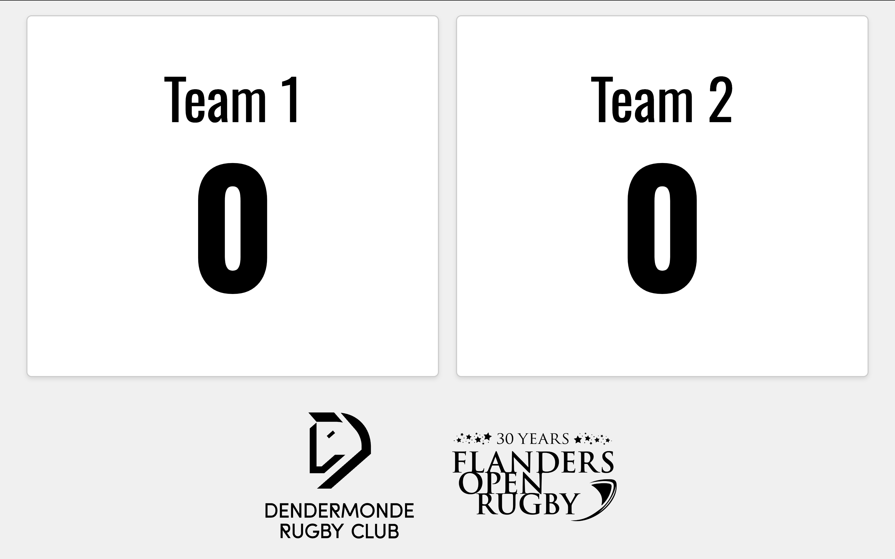
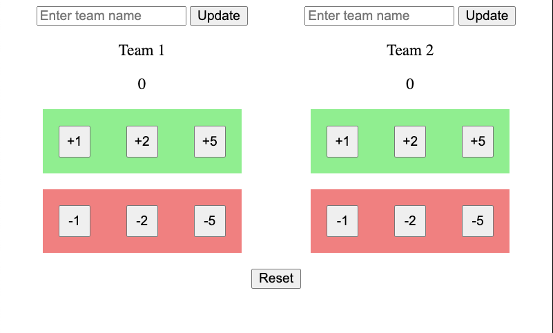

## Introduction

This is a simple web application that allows users to create and manage a scoreboard. The scoreboard has 2 windows. One for controlling the score and the other for displaying the score. The score is updated in real-time.

Example of the scoreboard:



Example of the control panel:



## Local develeopment 

```
npm start
```

## Release

This application is built and pacakaged in [Github Actions](./.github/workflows/main.yml)

```
npm version minor 
git push --follow-tags
```


## Next steps

- [ ] Implement team logo upload 
- [ ] Add score log
